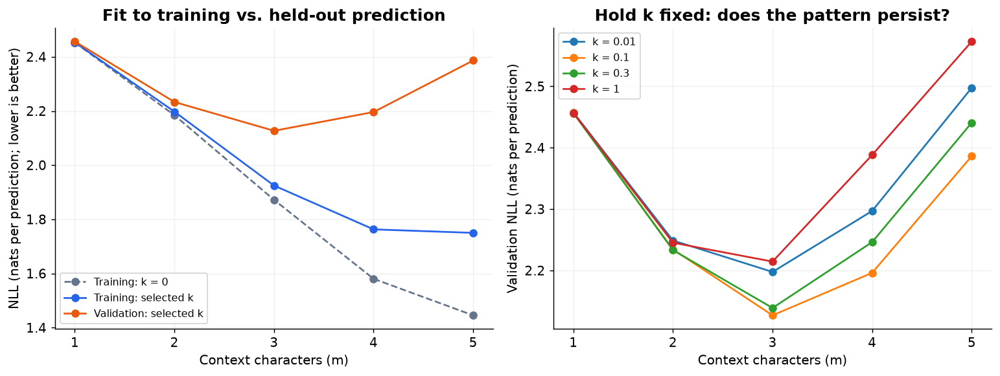
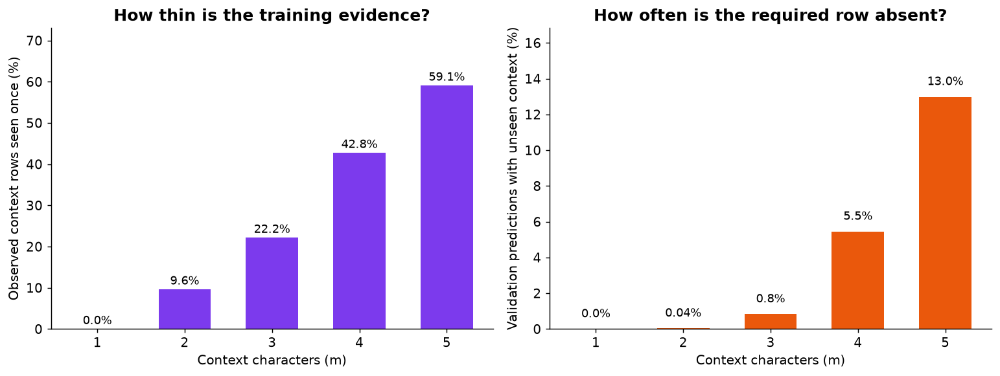

# Episode 02 · Coding companion and experiment

Start with [the theory reference](../../EPISODE_02_THEORY.md). It develops the
intuition, works through the arithmetic, and links the authoritative readings.
For a visual route, open [the 29-frame theory presentation](../../canvas/episode_02_theory.html)
or [the editable Excalidraw canvas](../../canvas/episode_02_trigrams.excalidraw).
Then attempt [the exercises](EXERCISES.md); [the answers](ANSWERS.md) are separate.

The experiment below belongs to the separate **coding video**. It is not
required for presenting the theory. See [the coding-video plan](CODING_VIDEO_PLAN.md)
and [the theory presenter guide](../../canvas/EPISODE_02_CANVAS_GUIDE.md).

## Start the coding episode

- [Executed notebook](episode_02.ipynb): 11 sections with all model code visible.
- [HTML reading copy](episode_02.html): download and open locally.
- [Code and learning guide](CODE_GUIDE.md): setup, Python concepts, and three learning passes.
- [Presenter guide](PRESENTER_GUIDE.md): five recording blocks, speaking cues, and checkpoints.
- [Coding report](outputs/coding_results.json): complete sweep, samples, and final test results.

Use the existing Episode 01 environment, or install `episodes/02_trigrams/requirements.txt`.
The notebook adds Matplotlib and Jupyter for presentation; the model remains standard-library Python.

```bash
.venv/bin/python episodes/02_trigrams/build_notebook.py --execute
```

This rebuilds the notebook in a fresh kernel and exports the HTML reader.
Without `--execute`, the builder creates an unexecuted notebook with outputs cleared.
Edit `lesson.py` for notebook code and narration; the builder converts its
percent-cell source to the notebook. Tests compare the visible core with `lab.py`.
`release_report.py` saves audit evidence after execution, outside the presentation.

## Run the lab

From the repository root, with Python 3.11 or newer:

```bash
# First: verify the anna / ava arithmetic.
python3 episodes/02_trigrams/lab.py --toy

# Second: compare longer contexts on the real names dataset.
python3 episodes/02_trigrams/lab.py --experiment

# Optional: save a new report without replacing the reference.
python3 episodes/02_trigrams/lab.py --experiment --output /tmp/episode-02-study.json

# Check the concepts implemented by the lab.
python3 -m unittest discover -s episodes/02_trigrams -p 'test_*.py' -v
```

The repository's `.venv/bin/python` also works. No packages or downloads are
needed: the model, experiment, and tests use the Python standard library and
Episode 01's bundled dataset. Verified with Python 3.14.2.

## Read the code in this order

| Function | Question to answer before moving on |
|---|---|
| `windows` | Why does each name produce length+1 targets, even with five START pads? |
| `CountModel.__init__` | What do the outer tuple key and inner target key represent? |
| `probability` | What changes between a zero count in an observed row and an absent row? |
| `evaluate` | Why do we feed in real history and include END in the denominator? |
| `generate` | How does the context shift after a sampled token? |
| `experiment` | Which decisions use validation, and what remains reserved? |

Try writing `windows` yourself before opening its implementation. It is the
main change from the previous episode. Generalizing from two context tokens
to m tokens is a loop/indexing change; it does not change the learning objective.

## Verified validation experiment

The same 29,494 unique names as Episode 01; split sizes 23,595 / 2,949 / 2,950
using shuffle seed 42. Training defines 26 ordinary characters and 27 next-token
outcomes. Every row below scores the same **21,141 validation predictions**.
NLL is total negative natural-log probability divided by all predicted
characters plus one END per name. START padding is not scored.

| Context characters | Selected k | Training NLL | Validation NLL ↓ | Observed rows | Rows seen once | Validation predictions with unseen context |
|---|---:|---:|---:|---:|---:|---:|
| 1 | 0.3 | 2.453138 | 2.456622 | 27 | 0 | 0 |
| 2 | 0.3 | 2.197541 | 2.233214 | 592 | 57 | 8 |
| 3 | 0.1 | 1.924842 | 2.126903 | 5,402 | 1,197 | 176 |
| 4 | 0.1 | 1.762922 | 2.196154 | 20,067 | 8,581 | 1,153 |
| 5 | 0.1 | 1.750099 | 2.386382 | 36,171 | 21,379 | 2,746 |

“Rows seen once” means total training evidence for the context equals one,
not that the row has only one distinct next-token type. “Unseen context” counts
prediction occurrences, not distinct contexts. Positive smoothing makes those
predictions scoreable, but does not make their contexts observed.

The historical experiment selects k from `[0.001, 0.01, 0.03, 0.1, 0.3, 1, 3, 10, 100]` using
validation only. These are the best of the tested candidates. The report also
contains unsmoothed training/evaluation diagnostics and all validation sweeps.
This historical validation-only report did not score test; the coding notebook now
reports the frozen comparison below. Do not compare this table's validation numbers
against Episode 01's **test** number 2.460499.

The coding notebook also includes `k = 0` in its candidate grid (50 settings in total).
All five unsmoothed validation losses are infinite on this split, so the selected
settings stay the same. The chart displays these results separately from its log axis.

What the measurements support:

- Trigrams improve substantially over bigrams on this split.
- Three characters of context give the lowest validation loss in this grid.
- Four and five characters improve selected-k training fit while validation
  loss rises; the unseen-context and singleton counts expose thinning evidence.
- This experiment measures plain add-k count models. It does not establish the
  limit of backoff, interpolation, or other classical smoothing methods.

## Inspect generation without cherry-picking

[The saved JSON report](outputs/study_results.json) includes the first 12
samples from each model, with seed 2026. `ended: false` means the 24-step cap
was reached, not that the model predicted END. `in_training` identifies exact
training spellings. Empty strings are allowed because smoothed start rows can
predict END. Samples illustrate behavior; use held-out loss for the numerical
comparison. Exact random samples may depend on Python version.

## Coding notebook results

Verified September 20, 2026 with Python 3.14.2. The notebook keeps the existing
context and smoothing grids, selects with validation, writes
[the frozen settings](outputs/frozen_selection.json), then scores every fixed
configuration on the same **21,053 test predictions**. Training counts are not
refitted on validation. Three context characters with k = 0.1 was selected by
validation; test did not select a new winner.

| Context characters | Model | Selected k | Validation NLL | Test NLL |
|---|---|---:|---:|---:|
| 1 | Bigram | 0.3 | 2.456622 | 2.460499 |
| 2 | Trigram | 0.3 | 2.233214 | 2.238901 |
| 3 | 4-gram | 0.1 | 2.126903 | 2.129940 |
| 4 | 5-gram | 0.1 | 2.196154 | 2.195605 |
| 5 | 6-gram | 0.1 | 2.386382 | 2.386533 |

This is the same test split previously reported in Episode 01, not newly
collected independent data. It remains excluded from this episode's fitting
and selection. Do not change the search after reading these scores. The result
applies to this dataset, split, and add-k family; it does not rank all n-gram
methods or establish a universal best context.





The two sparsity percentages have different denominators: observed training
rows, versus held-out prediction occurrences. Exact counts appear in the
notebook and report. The original `study_results.json` remains unchanged as
validation-only evidence from theory preparation.

## What is ready

- Executed 33-cell notebook with 18 code cells, plus an HTML reading copy.
- Three charts, full validation sweeps, fixed selections, unfiltered samples,
  and a final test report reproducing the Episode 01 bigram baseline.
- Code guide and presenter walkthrough with a five-block recording route.
- Theory companion, exercises, answer key, and mathematical/integration checks.

The notebook's main experiment uses add-k; backoff and interpolation remain
separate theory concepts, not hidden implementations in these results.
The [YouTube metadata](../../youtube/EPISODE_02B_METADATA.md) follows the recorded video.
