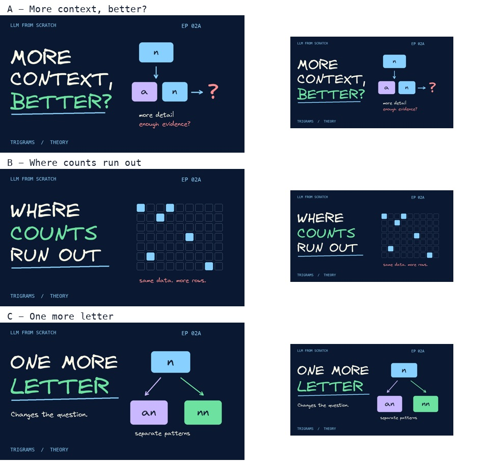

# Episode 02A thumbnail alternatives

All options are 1280 x 720 JPGs using the series' navy, cream, blue, and green palette and handwritten diagrams. No presenter photo or private asset is required. The sparse grid is schematic, not an experimental result.

| Choice | Hook | Why choose it |
|---|---|---|
| A - recommended | MORE CONTEXT, BETTER? | Opens the episode's central question without promising that more context always helps or hurts |
| B | WHERE COUNTS RUN OUT | Emphasizes sparse evidence and the limits of exact-context tables |
| C | ONE MORE LETTER | Emphasizes the change from one history character to two; gentlest continuation from Episode 01 |



- [A: More context](thumbnails/episode-02a-more-context.jpg)
- [B: Counts run out](thumbnails/episode-02a-counts-run-out.jpg)
- [C: One more letter](thumbnails/episode-02a-one-more-letter.jpg)

Rebuild from the repository root:

```bash
python3 youtube/build_episode_02_thumbnails.py
```

Dependencies: Pillow, bundled Virgil font, and Menlo on macOS. The comparison sheet includes full and feed-size previews. No alternative has been selected or uploaded on the user's behalf.
