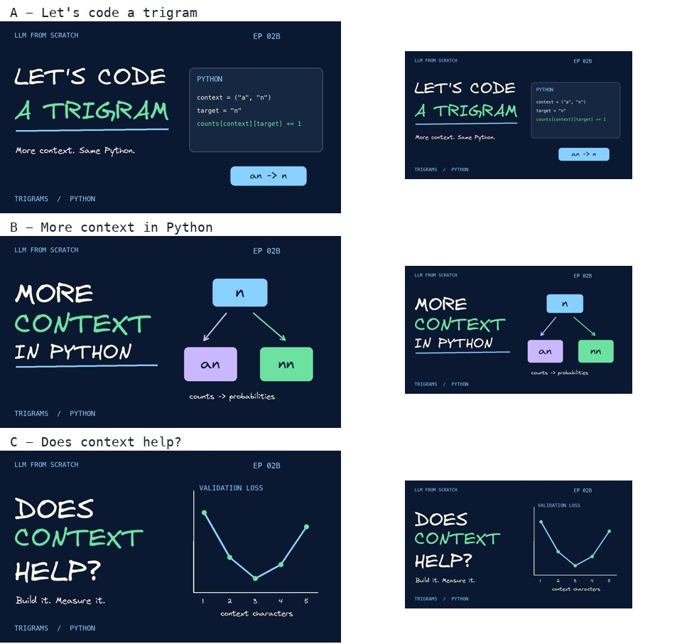

# Episode 02B thumbnail choices

| Choice | Hook | Use when |
|---|---|---|
| A - recommended | LET'S CODE A TRIGRAM | You want the topic and coding format immediately clear |
| B | MORE CONTEXT IN PYTHON | You want the connection to the bigram episode emphasized |
| C | DOES CONTEXT HELP? | You want the experiment's question to lead |

- [A](thumbnails/episode-02b-lets-code-trigram.jpg)
- [B](thumbnails/episode-02b-more-context-python.jpg)
- [C](thumbnails/episode-02b-does-context-help.jpg)

All are 1280 x 720 JPGs, under 2 MB, with navy #0B1831 and the existing series font/palette. No private presenter image is used. Option C's curve uses actual selected-k validation values from the coding report; it is a compact thumbnail illustration, not a replacement for the fully labeled notebook chart.

Rebuild: `python3 youtube/build_episode_02b_thumbnails.py` (Pillow and macOS Menlo).
