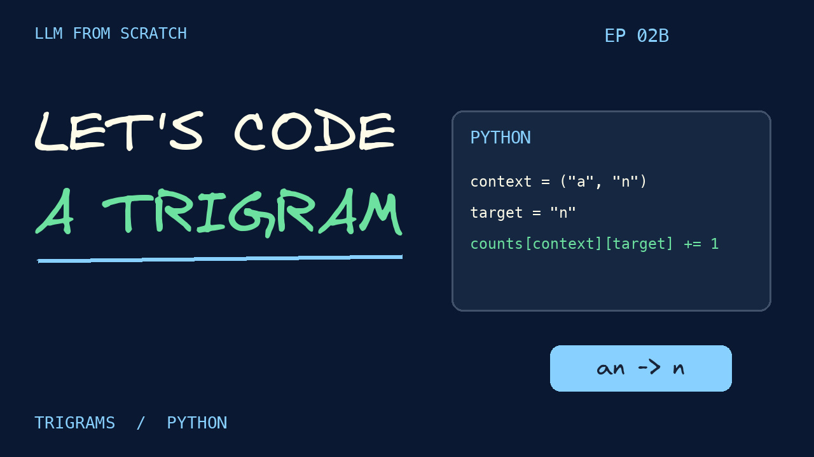

# Episode 02B selected thumbnail

**LET'S CODE A TRIGRAM** - the user selected option A, with its supporting tagline removed.

1280 x 720 JPG, under 2 MB, with navy #0B1831 and the existing series font/palette. No private presenter image is used. Only this selected thumbnail is retained.

Rebuild: `python3 youtube/build_episode_02b_thumbnails.py` (Pillow and macOS Menlo).
